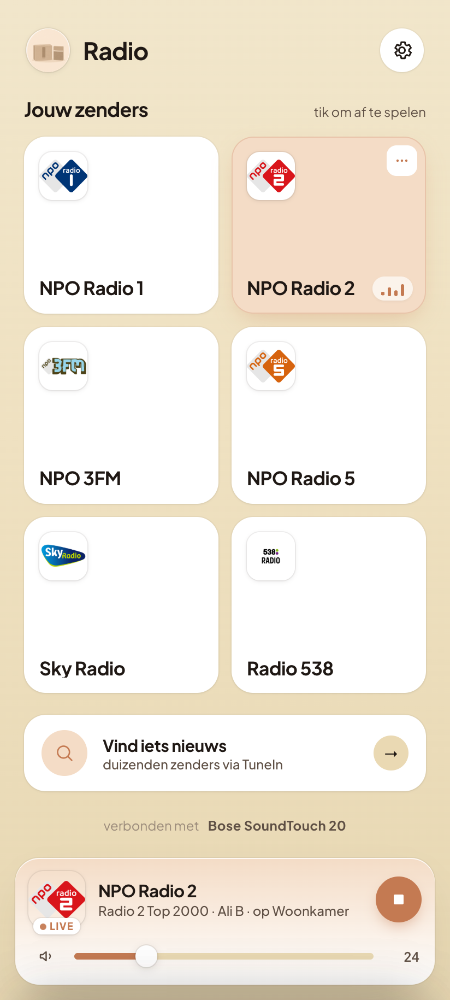
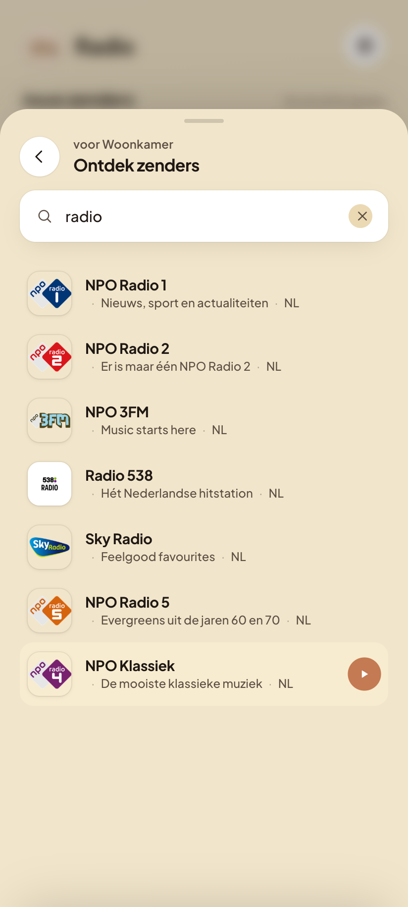
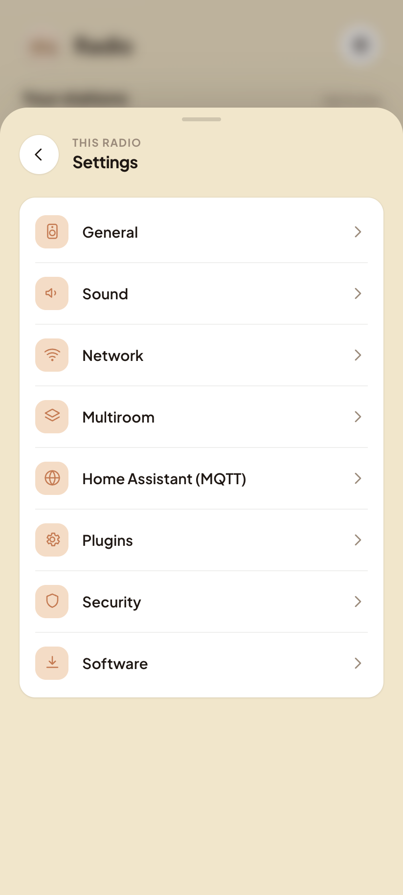

# ReTouch · for SoundTouch

ReTouch brings internet radio back to Bose SoundTouch speakers after Bose shut
down its servers. It is a small, self-contained stand-in for the part of the Bose
cloud the speaker relies on: it runs on the speaker itself and **emulates the
cloud API** the firmware expects, so the speaker's own internet-radio sources
light up again.

On top of that it serves a clean little web app so you can search stations, set
presets, and control playback from your phone or browser.

> A simple way to get basic internet-radio functionality back after Bose's
> servers were switched off. "SoundTouch" and "Bose" are trademarks of Bose
> Corporation; ReTouch is an unofficial community project — use at your own risk.

## Screenshots

| Home | Search | Settings |
|:---:|:---:|:---:|
|  |  |  |

## What it does

- 🔎 **Search internet radio** — TuneIn's public directory, no account or key
- ⭐ **Six presets**, stored as the speaker's own native presets
- ▶️ **Play / stop and volume**, with live now-playing (station name + logo)
- 🔗 **Multiroom** — find your other ReTouch speakers and group them so they play
  in sync, using Bose's own native zones
- 🏠 **Apple Home (HomeKit)** — the speaker shows up in the Home app and Siri as
  tappable tiles: a button per preset, a power switch, and a volume control
- ⚙️ **Settings** — speaker name, bass, and the app's language
- ⬆️ **Over-the-air updates** — update straight from the app; the speaker fetches
  the latest release and restarts itself

## How it works

While Bose ran the cloud, the speaker checked in with Bose's servers to keep its
internet-radio sources enabled. With those servers gone, the sources stop working.

ReTouch **emulates that cloud API locally, on the speaker**, so the firmware sees
a healthy "cloud" again and re-enables its native radio. It does not stream or
re-route audio — the speaker plays radio itself, exactly as before; ReTouch only
takes the place of the API that used to live at Bose. A small web app on the
speaker adds the search, presets, and controls.

**Multiroom** works the same way — through the speaker, not around it. ReTouch
finds your other ReTouch speakers on the network and uses Bose's own zone API to
group them, so one speaker leads and the rest play in perfect sync, exactly like
multiroom did when the Bose app still worked.

## Apple Home (HomeKit)

ReTouch can bridge the speaker into **Apple Home**, so you can control it from the
Home app and Siri ("Hey Siri, turn on the kitchen speaker", "play preset 2"). It is
enabled by the installer and appears as a **bridge** with plain, tappable tiles: a
**switch per preset** (tap to play; the playing preset shows as on), a **power
switch**, and a **volume** control (a dimmable "light" whose brightness is the volume
— the Home app has no speaker-volume slider, so this is the idiomatic way to get one).

> A *Television* accessory would be the obvious media type, but the stock Home app
> shows "no controls available" for it and never renders preset "inputs" as buttons —
> so ReTouch uses switches + a brightness slider, which actually work there.

To pair it, open the **Home** app → **Add Accessory** → *More options*, pick the
speaker, and enter the **setup code** shown in ReTouch's Settings (also available at
`http://<speaker>:8080/api/homekit`). The code is fixed per speaker.

This bridge only stands in for HomeKit — the speaker still plays radio itself, exactly
as before. It uses one Go dependency (`github.com/brutella/hap`) for the HomeKit
protocol; the rest of ReTouch stays dependency-free.

## Install (and update)

Installation is fully **wireless** — nothing is installed on your computer. Paste
this one line into a terminal:

```sh
curl -fsSL https://raw.githubusercontent.com/stein155/retouch/main/install/install.sh | sh
```

The installer finds the Bose speakers on your network, lets you pick one (or type
an address yourself), sets ReTouch up over the air, and then prints the link to
open. The speaker restarts once and is back in a minute or two.

> Already know the address? Skip the search:
> `curl -fsSL .../install.sh | sh -s -- 192.168.1.42`

It needs two common tools, `curl` and `nc` (netcat), which ship with macOS and most
Linux systems.

When it finishes you'll get a link like `http://192.168.1.42:8080`. Open it on your
phone and use **Add to Home Screen** to keep ReTouch around like a normal app.

**To update**, open the app and tap **Update now** in Settings — the speaker
fetches the latest release over the air and restarts (about a minute). It does
nothing if you're already up to date. You can also just run the install line
again, which does the same thing.

**To undo everything** (restore the factory configuration and remove ReTouch), run
`install/uninstall.sh` on the speaker and reboot.

## Tested on

ReTouch has been verified on the following speakers and firmware versions:

| Speaker | Firmware |
|---|---|
| Bose SoundTouch 10 | `27.0.6.46330.5043500 epdbuild.trunk.hepdswbld04.2022-08-04T11:20:29` |
| Bose SoundTouch 10 | `27.0.3.46298.4608935 epdbuild.trunk.hepdswbld04.2021-10-06T16:35:02` |
| Bose SoundTouch 20 | `27.0.6.46330.5043500 epdbuild.trunk.hepdswbld04.2022-08-04T11:20:29` |

Other SoundTouch models and firmware versions may work too — if you try one, let us know.

## Repo layout

```
main.go              flags + HTTP servers (web app + local cloud-API emulation)
internal/tunein/     TuneIn directory client (search / resolve / describe)
internal/speaker/    speaker control (play, presets, volume, name, bass, multiroom zones)
internal/discover/   finds other ReTouch speakers on the LAN (for multiroom)
internal/marge/      local emulation of the Bose cloud API the firmware expects
internal/homekit/    HomeKit (HAP) bridge — exposes the speaker to Apple Home
internal/autopair/   keeps the speaker's sources enabled
internal/settings/   persisted app settings (name, bass, language)
internal/store/      small on-disk state (presets, etc.)
internal/web/        JSON API + the embedded web app (built from frontend/)
frontend/            web app source (React + Vite, embedded via go:embed)
install/             wireless install: install.sh (find + set up) / netinstall.sh / uninstall.sh
.github/             CI: build + publish releases, Release Drafter
```

## Thanks

ReTouch stands on the shoulders of the SoundTouch community that refused to let
these speakers go quiet. With gratitude to:

- **[AfterTouch](https://github.com/gesellix/Bose-SoundTouch)** — for the groundwork
  on talking to the speaker and keeping its native sources alive.
- **[SoundCork](https://github.com/deborahgu/soundcork)** — for sharing how the
  firmware and its services fit together.
- **[Streborn](https://github.com/JRpersonal/streborn)** — for paving the way on
  getting code onto the speaker.

Thank you for keeping good hardware playing. 🎵
